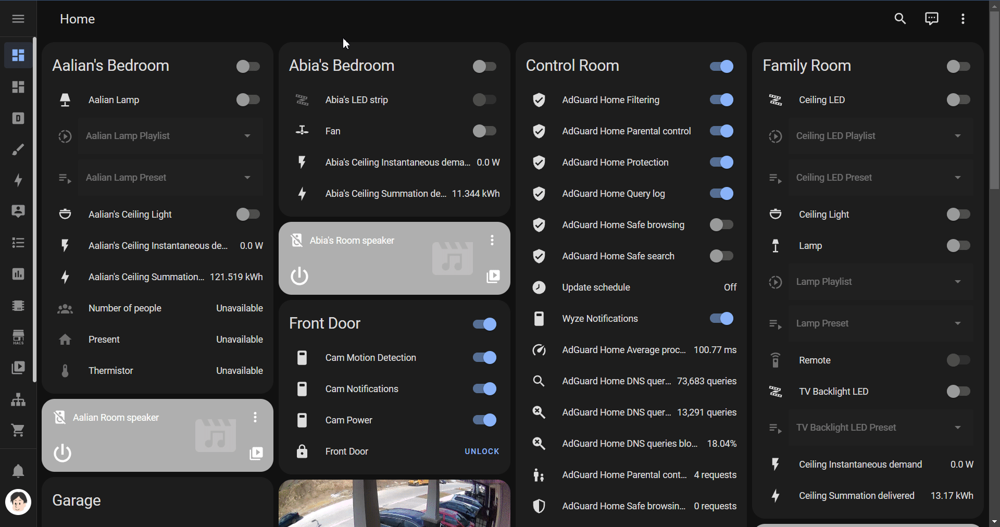

# Mushroom Dashboard Strategy 🍄✨

[![Release][releaseBadge]][releaseUrl]
[![HACS][hacsBadge]][hacsUrl]
[![Codacy][codacyBadge]][codacyUrl]

---

**Effortlessly create stunning Home Assistant Dashboards with the Mushroom Dashboard Strategy!**

- Are you tired of manually configuring your Home Assistant dashboards?
  Do you love the elegant design of Mushroom cards but wish for a simpler way to organize your entities,
  devices, and areas?

The **Mushroom Dashboard Strategy** is your solution.
It automatically generates beautiful, organized dashboards for Home Assistant,
leveraging the power and aesthetics of Mushroom cards with minimal configuration.

---

## ⭐ **Why Choose Mushroom Dashboard Strategy?**

- **⚡️ Automatic Dashboard Generation:** Go from zero to a beautiful dashboard with just a few lines of YAML.
- **🏡 Intelligent Organization:** Automatically creates intuitive views for your devices, areas, and entities.
- **🎨 Highly Customizable:** Tailor your dashboard to your unique smart home setup with extensive options.
- **📈 Integrated Insights:** Seamlessly displays mini graph cards for your sensor data.

---

## 🚀 **Get Started in Minutes!**

Ready to transform your Home Assistant experience?

The **Mushroom Dashboard Strategy** is available through HACS (Home Assistant Community Store).

➡️ **[Explore the detailed documentation for Installation & Usage Guides!](https://digilive.github.io/mushroom-strategy/)**

---

## 📸 **Sneak Peek**

---

## 🤝 **Contributing & Support**

We welcome contributions and feedback!

- Have questions or need help?
  Check out our [Discussions](https://github.com/DigiLive/mushroom-strategy/discussions) page.

- Found a bug or have an idea?
  Open an [Issue](https://github.com/DigiLive/mushroom-strategy/issues).

- Enjoying the Mushroom Strategy?
  Consider giving our project a ⭐ [star on GitHub](https://github.com/DigiLive/mushroom-strategy) and exploring ways
  to ❤️ [sponsor the project](https://github.com/sponsors/DigiLive) to support its continued development!
  Your support helps us grow and improve.

---

<!-- Badge References -->

[codacyBadge]: https://app.codacy.com/project/badge/Grade/24de1e79aea445499917d9acd5ce9e04

[hacsBadge]: https://img.shields.io/badge/HACS-Default-blue

[releaseBadge]: https://img.shields.io/github/v/tag/digilive/mushroom-strategy?filter=v3.2.0&label=Release

<!-- Repository References -->

[releaseUrl]: https://github.com/DigiLive/mushroom-strategy/releases/tag/v3.2.0

<!-- Other References -->

[codacyUrl]: https://app.codacy.com/gh/DigiLive/mushroom-strategy/dashboard?utm_source=gh&utm_medium=referral&utm_content=&utm_campaign=Badge_grade

[hacsUrl]: https://hacs.xyz
